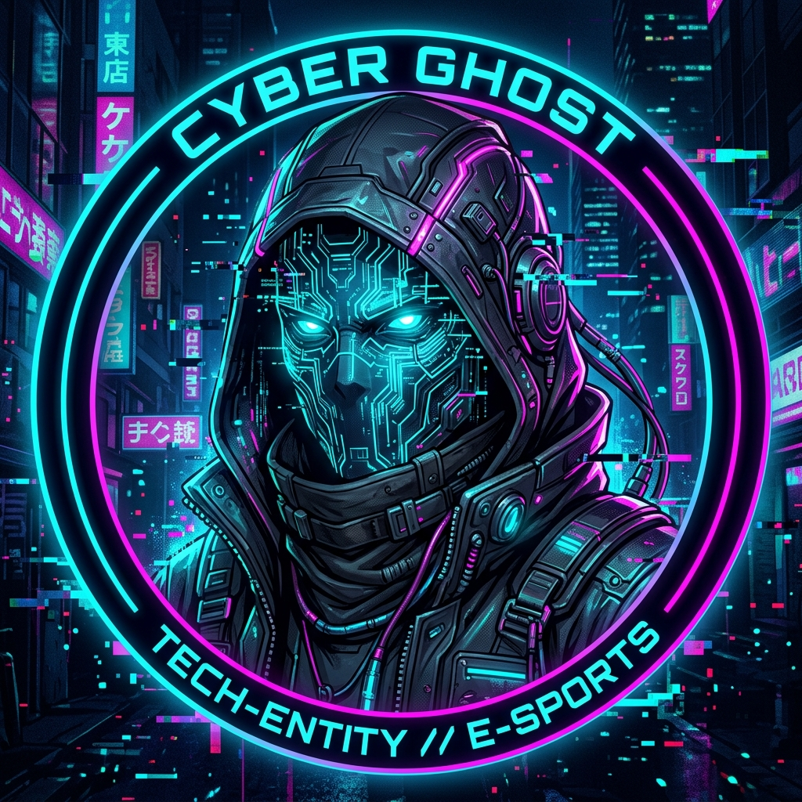

# ⚡ [SYSTEM OVERRIDE INITIATED]

  

  

  

---

### 📂 [SYSTEM_DIAGNOSTICS]

<table border="0">
  <tr>
    <td width="30%" align="center">
      
       
      <code>[ID: UTKARSH_JAIN]</code>
    </td>
    <td width="70%">
      

        <b>GREETINGS, OPERATIVE.</b>  
        My name is <b>Utkarsh Jain</b>. I am a tech architect specializing in <b>Cyber Security</b> and <b>Creative Development</b>. I thrive in the intersection of aesthetics and security, building systems that are as secure as they are stunning.
      

      <ul>
        <li><b>Current Objective:</b> Building creative, secure architectures.</li>
        <li><b>Status:</b> Online / Active</li>
        <li><b>Interests:</b> AI, Deep Learning, Threat Intel, System Security.</li>
      </ul>
    </td>
  </tr>
</table>

---

### 🛠️ [CORE_OBJECTIVES]

> "The matrix is everywhere. It is all around us."

- 🛡️ **Cyber Security**: Penetration testing, threat modeling, and securing the digital frontier.
- 🎨 **Creative Building**: Crafting immersive digital experiences with modern tech stacks.
- 🧠 **AI & Deep Learning**: Integrating intelligence into the core of system operations.

---

### 💻 [TECHNICAL_STACK]

  
  
  
  
  
  

---

### 📡 [THREAT_INTEL_NETWORK]

  
  

 

  
   
  

---

  

  <code>SYSTEM OVERRIDE COMPLETE // NO ERRORS FOUND</code>

